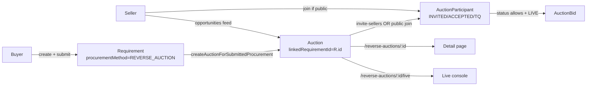

# CLAUDE.md

Guidance for Claude Code in this repo. **Keep this file lean** — it loads every session. Store stable architecture + commands + gotchas only. Do **not** turn it into a changelog (git does that). Update only when a *durable* fact changes (new module, convention, command, or architectural rule).

## What this is

MSME procurement + marketplace platform (SMILE). npm-workspaces monorepo:
- `backend/` — Express + Prisma + TypeScript (ESM). REST API under `/api`.
- `frontend/` — Next.js + React + React Query (@tanstack) + Tailwind + TypeScript.
- `tools/` — dev/security/readiness scripts. `docs/` — design docs.

## Commands

Run from repo root unless noted.

| Task | Command |
|------|---------|
| Dev (both) | `npm run dev` |
| Typecheck (both) | `npm run typecheck` |
| Backend typecheck | `cd backend && npm run typecheck` |
| Frontend typecheck | `cd frontend && npm run typecheck` |
| Integration tests | `npm run test:integration` |
| Security tests | `npm run test:security` |
| Prisma validate | `npm run prisma:validate` |
| Production readiness | `npm run production:check` |
| Portal smoke test | `npm run smoke:portal` |
| Full pre-ship gate | `npm run security:check` |

Always run `npm run typecheck` after edits before claiming done.

## Architecture facts

- **Backend entry**: `backend/index.ts` → routes in `backend/src/routes/*.routes.ts` (21 route files; `phase4.routes.ts` is the large procurement hub).
- **Prisma access pattern**: `const db = prisma as any` — Prisma calls are untyped in route files by design. Schema: `backend/prisma/schema.prisma`.
- **ESM import specifiers**: backend imports use `.js` suffix even for `.ts` files (e.g. `import { x } from './y.js'`).
- **Frontend routing is client-side dispatch**, NOT App Router pages. A catch-all `src/app/[[...slug]]` renders `src/App.tsx`, which regex-matches `pathname` → components. To add/trace a route, edit `App.tsx`, not `app/`.
- **Features** live under `frontend/src/features/<domain>/` (pages, api.ts, components).
- **API layer** per feature: `frontend/src/features/<domain>/api.ts` wraps `lib/api`.

## Procurement ↔ Reverse-Auction model (key gotcha)

A reverse auction is stored as a **Requirement**, and its biddable **Auction** row has a *different* id (linked via `Auction.linkedRequirementId`). Requirement id ≠ Auction id. Many older links passed the requirement id where an auction id was expected → "Auction not found" / "not invited" bugs.

- URLs are canonical on **Auction.id**: `/reverse-auctions/:auctionId` and `/reverse-auctions/:auctionId/live`.
- Backend `resolveAuctionId()` (in `reverse-auction.routes.ts`) accepts **either** id (auction PK, else `linkedRequirementId`) — canonicalize server-side.
- Visibility: `Auction.visibilityMode` has no public value; "public" derives from the linked `Requirement.visibility === 'PUBLIC'`. Public RAs are viewable without invite; sellers self-enrol via `POST /reverse-auctions/:id/join`. Private RAs need a buyer invite (`invite-sellers`).

## Gotchas / constraints

- **`DATABASE_URL` is a shared remote Postgres (dev).** Migrate carefully; prefer no schema change. Isolated staging/prod DBs are still a pre-prod TODO.
- Prefer resolving/aliasing ids server-side over renaming routes.
- Procurement descriptions are stored as a machine blob `"Sourcing Method: X\nValue: Y\nUrgency: Z"` — strip before display (`cleanOpportunitySummary` in `SellerOpportunitiesPage.tsx`).
- Seller-scoped endpoints must hide competitor data (`maskSensitive`, own-org bid filtering).

## Personal cross-session notes

Diagnoses + decisions are also kept in Claude memory (`memory/*`, indexed by `memory/MEMORY.md`). Check there for prior investigation detail.
